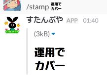

# slack-stamp-command
slackの絵文字を大きくするやつです

# 使い方
  1. https://<your-team-domain>.slack.com/services/new にアクセス

  2. "Slash Commands" で検索

  3. 適当に名前とかコマンド名(stampとか)を決めて "Add Slash Command Integration".

  4. 適当にアイコンとか変えたり設定変えたりする。Token文字列はメモっとく

  5. https://api.slack.com/custom-integrations/legacy-tokens でレガシーなslackTokenを手に入れる。メモっとく。

  6. https://slack.com/api/emoji.list?token=手に入れたレガシーなトークン&pretty=1 で登録した絵文字の実態画像リンクが取得できることを確認。 

  7. AWS lamdaのページにアクセスして関数の作成から設計図を「slack-echo-command」で検索。nodejsバージョンがあるのでそれをクリック

  8. Lambda 関数のコードにindex.jsをベタッとコピペ

  9. 環境変数にurl_token(slackのレガシーなトークン)、token(slackのトークン)を設定。

  10. lamdaのエンドポイントURLをメモってslackのコマンドのURLに貼り付け。
  
  11. あとは好きなチャンネルで絵文字が大きくなるはず。おわり。

参考
http://dev.classmethod.jp/cloud/aws/slack-integration-blueprint-for-aws-lambda/
